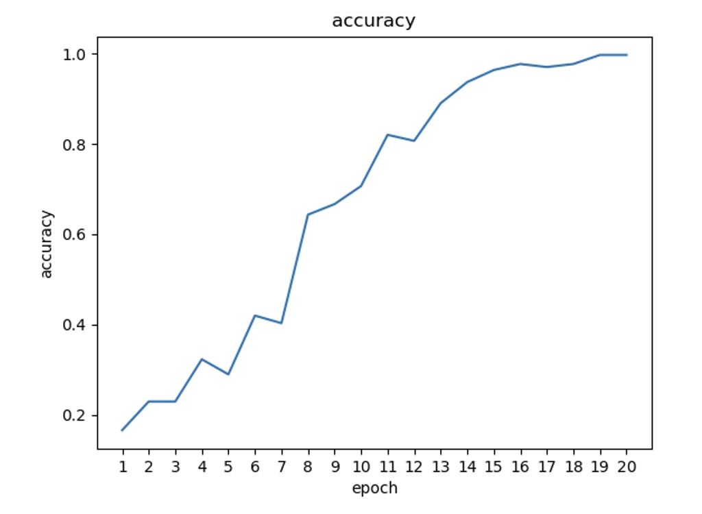
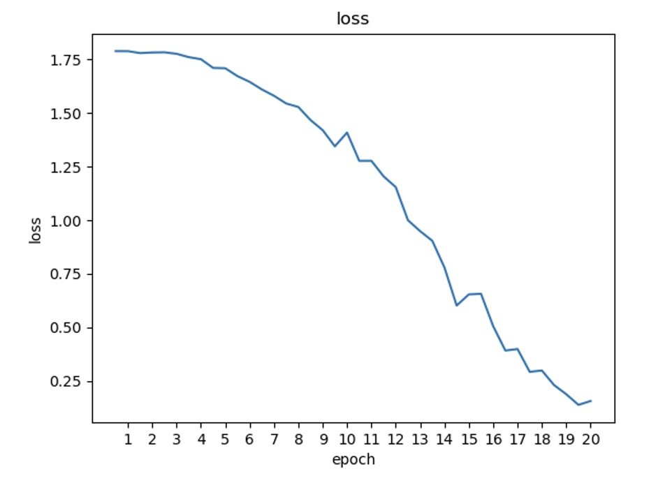
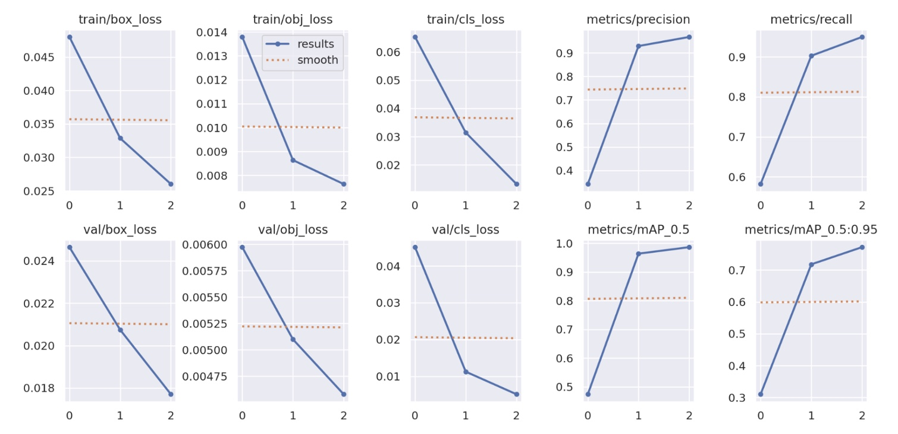
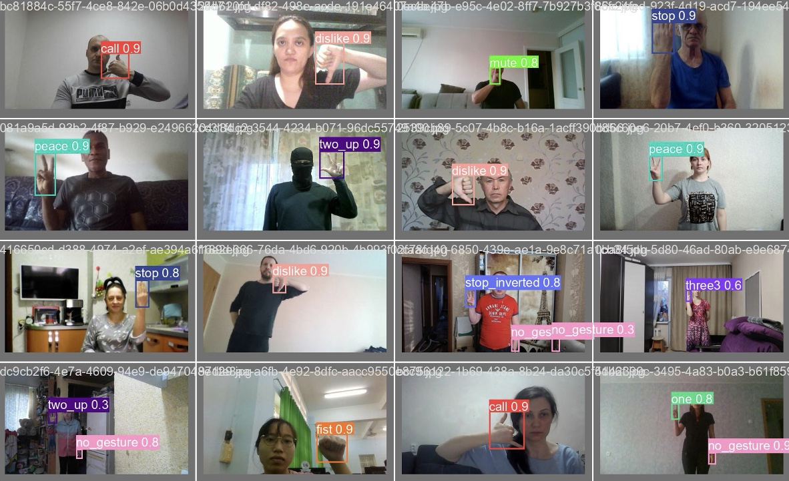

# Gesture Recognition using YOLOv5

## 專案簡介
本專案使用 YOLOv5 模型進行手勢辨識。使用 Hagrid Dataset 進行訓練，目標為同時並精準辨識多個手勢，如 peace, stop, mute, dislike 等多種手勢。

## 訓練結果分析

### 1. 模型準確度與損失函數 (Accuracy & Loss)
在 20 個 Epoch 的訓練過程中，模型準確度穩定上升並收斂，Training Loss 也呈現健康的下降趨勢。

#### 準確度變化 (Accuracy vs. Epoch)

#### 訓練損失 (Loss vs. Epoch)

### 2. 評估指標 (Metrics)
從各項指標（box_loss, obj_loss, mAP）可以看出，模型在 mAP@0.5 達到了極高的水準，具有良好的實用性。

### 3. 實際預測結果 (Bounding Box Predictions)
以下為模型對實際影像進行偵測的輸出結果，成功框出目標手勢，辨識結果非常準確且穩定。

